# エピソードキャッシュシステム 設計書

## 1. 概要

一度閲覧したエピソードを自動的にキャッシュし、2回目以降の表示を高速化する機能の設計書。
また、改稿されたエピソードを検知し、適切に再取得する仕組みを提供する。

## 2. 目的

- **表示の高速化**: 一度パースしたエピソードをキャッシュし、再パースのオーバーヘッドを削減する
- **オフライン対応**: 明示的なダウンロード操作なしで、閲覧済みエピソードをオフラインでも読めるようにする
- **改稿への対応**: エピソードが改稿された場合に検知し、最新の内容を取得できるようにする
- **ユーザー体験の統一**: 明示的ダウンロードと自動キャッシュを統一されたデータ構造で管理する

## 3. 現状の課題

### 3.1. キャッシュの未活用

現在の`getEpisode`メソッドは、ダウンロード済みエピソードがなければ毎回APIからフェッチしてパースを行う。
一度閲覧したエピソードでも再度パース処理が走り、無駄なネットワーク通信とCPU負荷が発生する。

```dart
// 現状の実装
Future<List<NovelContentElement>> getEpisode(String ncode, int episode) async {
  final downloaded = await _db.getDownloadedEpisode(ncode, episode);
  if (downloaded != null) {
    return downloaded.content;
  }
  return _fetchEpisodeContent(ncode, episode);  // キャッシュせずに返している
}
```

### 3.2. 改稿検知の不在

キャッシュしたエピソードが改稿されたかどうかを判定する仕組みがない。
古いキャッシュを表示し続ける可能性がある。

### 3.3. 2つのテーブルの役割の曖昧さ

- `Episodes`: エピソードのキャッシュ（HTML形式、あまり使われていない）
- `DownloadedEpisodes`: ダウンロード済みエピソード（パース済み構造化データ）

役割が重複しており、統一されていない。

## 4. 設計方針

**「閲覧したエピソードは自動キャッシュし、改稿を検知して適切に更新する」**

### 4.1. キャッシュ戦略

| ケース | 動作 |
|--------|------|
| 目次経由でエピソードを開く | キャッシュの`revised` ≠ 目次の`revised` なら再fetch |
| 履歴から直接エピソードを開く | キャッシュあり→返す、なし→fetch&キャッシュ |
| キャッシュなし | fetch → キャッシュに保存 → 返す |

### 4.2. 改稿検知の仕組み

なろう小説の目次ページには、各エピソードの改稿日時が含まれている。

```html
<!-- 改稿されたエピソード -->
<div class="p-eplist__sublist">
  <a href="/n6753le/6/" class="p-eplist__subtitle">6.名無しの転移者さん</a>
  <div class="p-eplist__update">
    2025/10/22 12:00
    <span title="2025/10/31 01:12 改稿">（<u>改</u>）</span>
  </div>
</div>

<!-- 改稿されていないエピソード -->
<div class="p-eplist__sublist">
  <a href="/n6753le/7/" class="p-eplist__subtitle">7.魔術触媒</a>
  <div class="p-eplist__update">
    2025/10/23 12:00
  </div>
</div>
```

この情報を利用し、キャッシュ時点の`revised`と目次取得時の`revised`を比較することで、
エピソード単位で改稿を検知できる。

### 4.3. 状態判定方式

`status`カラムを使わず、`content`の中身で状態を判定する。

| content | 意味 |
|---------|------|
| `[]` (空配列) | ダウンロード失敗 |
| `[...]` (中身あり) | 成功（キャッシュ有効） |
| レコードなし | 未キャッシュ |

```dart
// 判定ロジック
if (cached == null) {
  // 未キャッシュ → fetch
} else if (cached.content.isEmpty) {
  // 失敗 → 再fetch
} else {
  // 成功 → キャッシュ返す（revised比較も）
}
```

## 5. 状態遷移図

### 5.1. キャッシュ状態

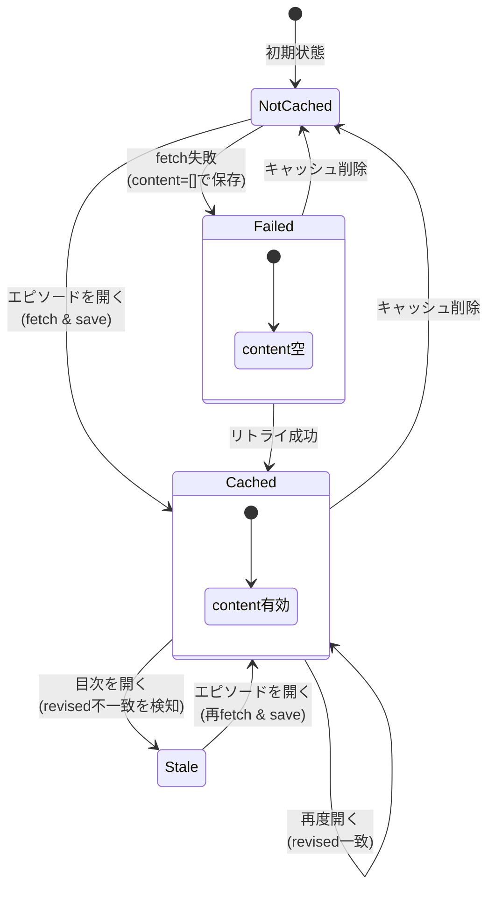

### 5.2. エピソード取得の状態遷移

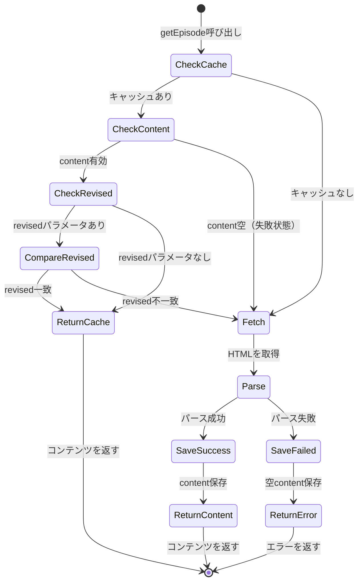

## 6. シーケンス図

### 6.1. 目次経由でエピソードを開く（キャッシュヒット）

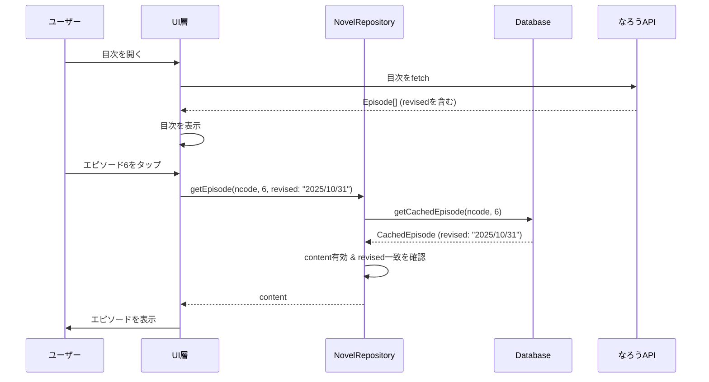

### 6.2. 目次経由でエピソードを開く（改稿検知）

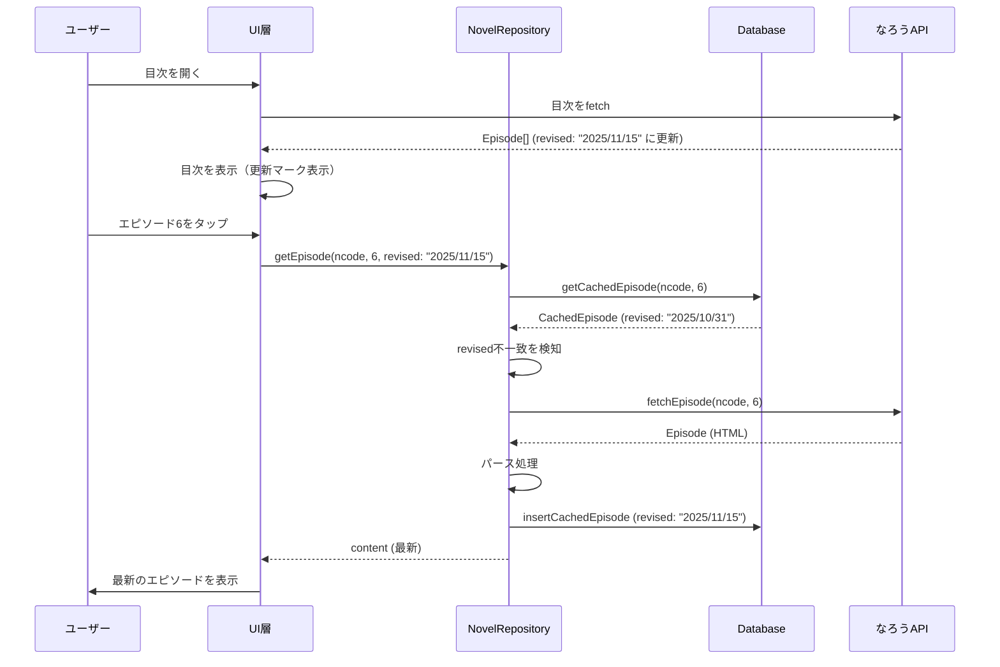

### 6.3. 履歴から直接エピソードを開く

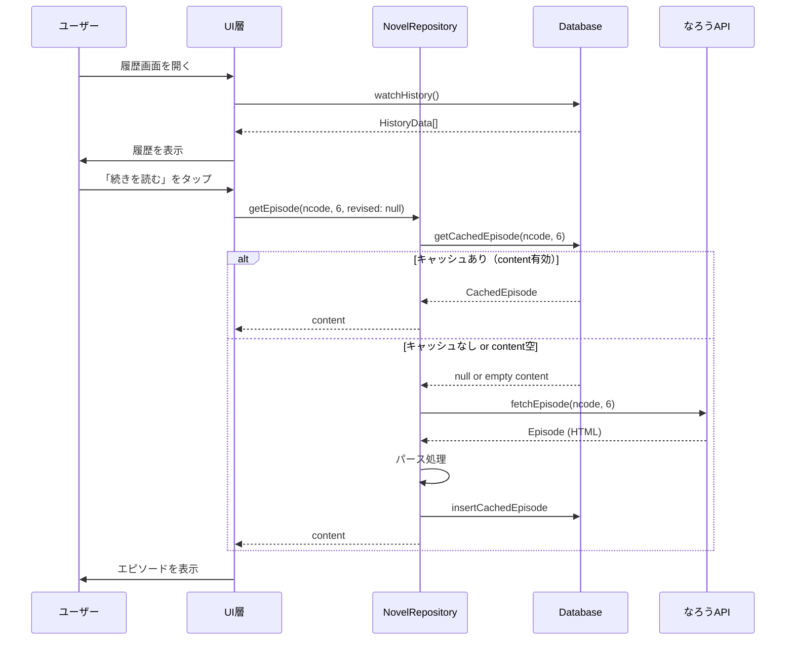

### 6.4. 明示的ダウンロード（一括）

一括ダウンロードでは、最初に目次を取得して各エピソードの`revised`情報を取得し、
それを使ってキャッシュの更新判定を行う。

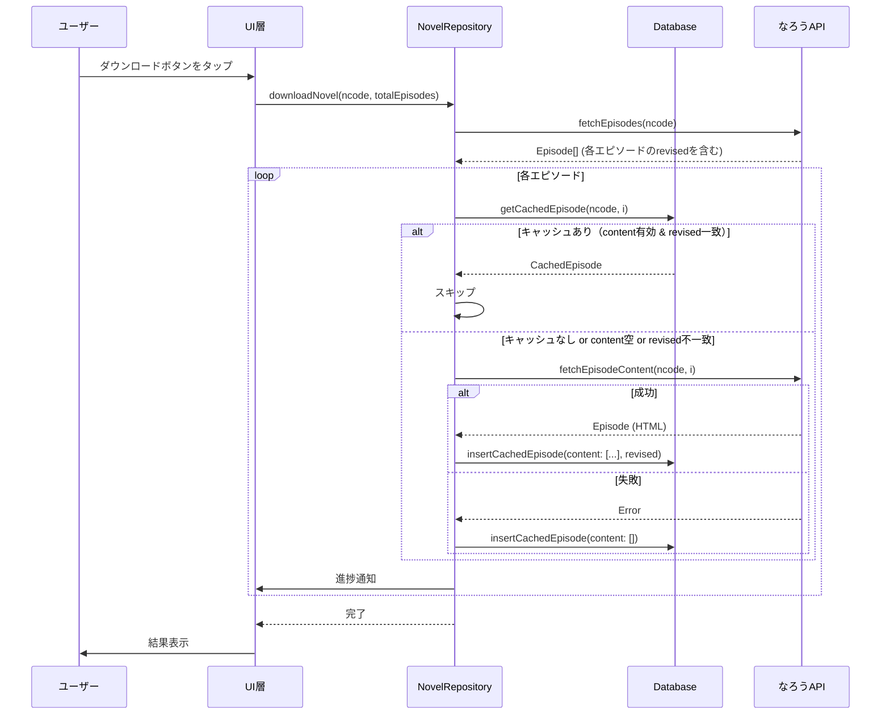

## 7. データ設計

### 7.1. テーブル変更

`DownloadedEpisodes`テーブルを`CachedEpisodes`にリネームし、スキーマを変更する。

#### 変更前

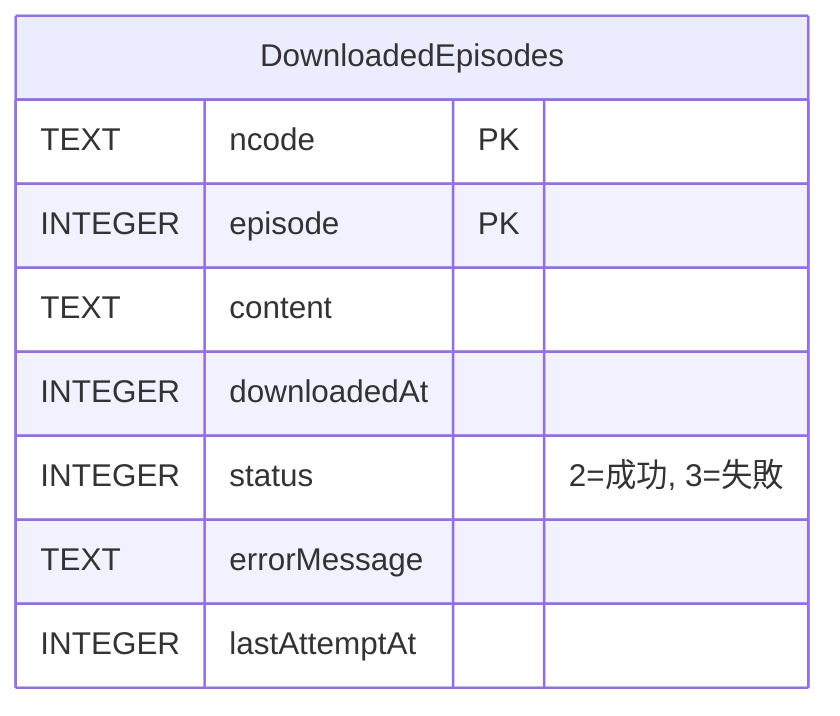

#### 変更後

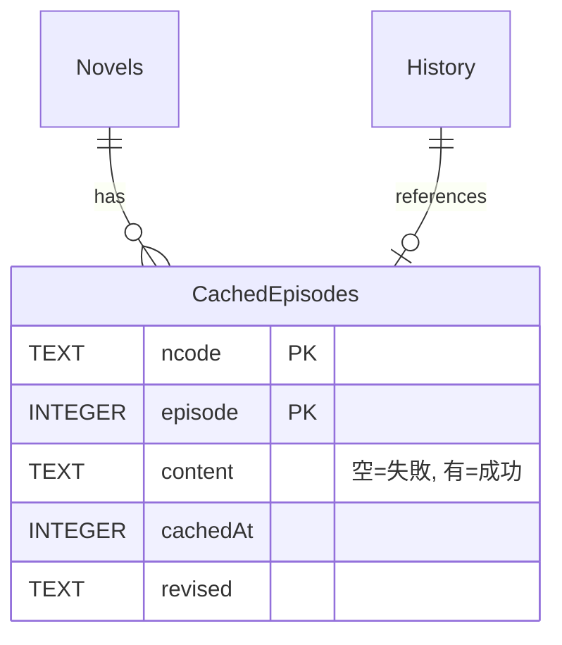

### 7.2. カラム詳細

| カラム | 型 | 説明 |
|--------|-----|------|
| ncode | TEXT | 小説のncode (PK) |
| episode | INTEGER | エピソード番号 (PK) |
| content | TEXT | パース済みコンテンツ (JSON)。空配列=失敗、中身あり=成功 |
| cachedAt | INTEGER | キャッシュ日時 (旧downloadedAt) |
| revised | TEXT | キャッシュ時点の改稿日時 (nullable) |

#### 削除されるカラム

| カラム | 削除理由 |
|--------|---------|
| status | contentの中身で判定するため不要 |
| errorMessage | 失敗の詳細は不要（リトライすればいい） |
| lastAttemptAt | 自動キャッシュでは不要 |

### 7.3. マイグレーション

```dart
if (from <= 10) {
  // DownloadedEpisodes → CachedEpisodes にリネーム & スキーマ変更
  // 不要なカラムを削除し、revisedカラムを追加
  await customStatement('''
    CREATE TABLE cached_episodes (
      ncode TEXT NOT NULL,
      episode INTEGER NOT NULL,
      content TEXT NOT NULL,
      cached_at INTEGER NOT NULL,
      revised TEXT,
      PRIMARY KEY(ncode, episode)
    )
  ''');

  await customStatement('''
    INSERT INTO cached_episodes (ncode, episode, content, cached_at, revised)
    SELECT ncode, episode, content, downloaded_at, NULL FROM downloaded_episodes
  ''');

  await customStatement('DROP TABLE downloaded_episodes');

  // 未使用のEpisodesテーブルを削除
  await customStatement('DROP TABLE IF EXISTS episodes');
}
```

## 8. 処理フロー

### 8.1. エピソード取得フロー

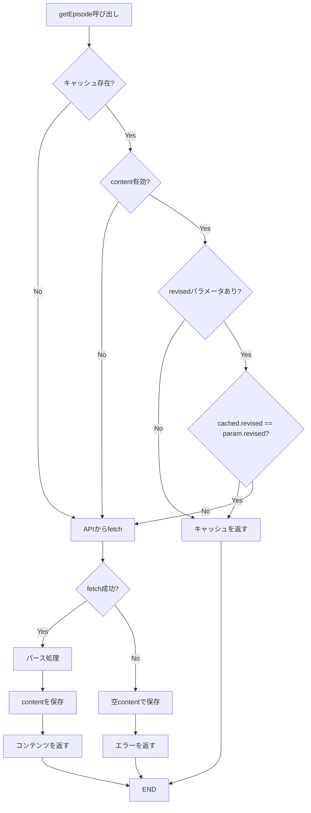

### 8.2. ダウンロード状態判定フロー

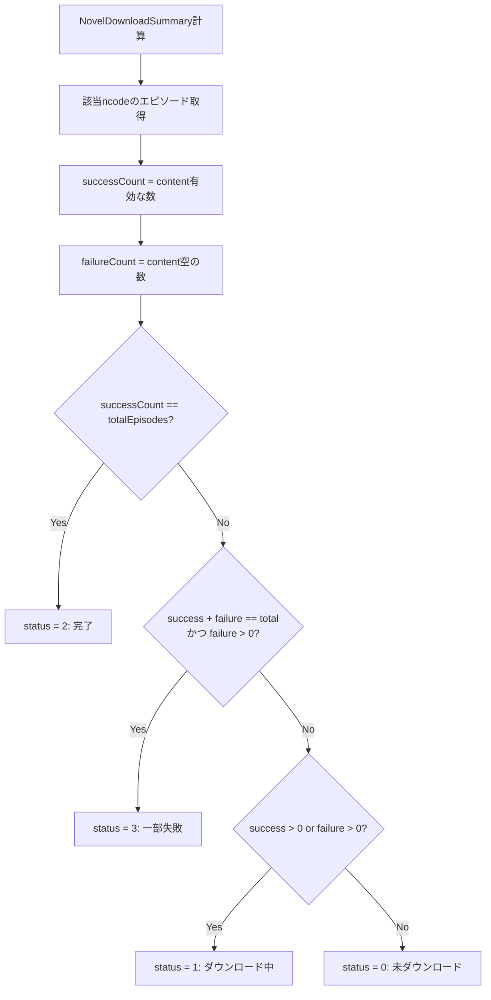

### 8.3. 目次表示と更新検知フロー

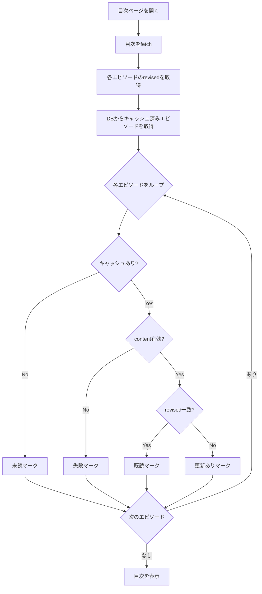

## 9. API設計

### 9.1. NovelRepository

```dart
/// エピソードを取得する（キャッシュ対応版）
///
/// [revised] が指定された場合、キャッシュの改稿日時と比較し、
/// 異なる場合は再取得する。
Future<List<NovelContentElement>> getEpisode(
  String ncode,
  int episode, {
  String? revised,
}) async {
  final cached = await _db.getCachedEpisode(ncode, episode);

  // キャッシュが存在し、content有効で、改稿日時が一致する場合はキャッシュを返す
  if (cached != null && cached.content.isNotEmpty) {
    if (revised == null || cached.revised == revised) {
      return cached.content;
    }
  }

  // fetch & cache
  try {
    final content = await _fetchEpisodeContent(ncode, episode);
    await _db.insertCachedEpisode(
      CachedEpisodesCompanion(
        ncode: Value(ncode.toNormalizedNcode()),
        episode: Value(episode),
        content: Value(content),
        cachedAt: Value(DateTime.now().millisecondsSinceEpoch),
        revised: Value(revised),
      ),
    );
    return content;
  } on Exception {
    // 失敗時は空contentで保存
    await _db.insertCachedEpisode(
      CachedEpisodesCompanion(
        ncode: Value(ncode.toNormalizedNcode()),
        episode: Value(episode),
        content: const Value([]),
        cachedAt: Value(DateTime.now().millisecondsSinceEpoch),
        revised: Value(revised),
      ),
    );
    rethrow;
  }
}
```

### 9.2. Database (集計ロジック変更)

```dart
/// 小説のダウンロード状態の集計情報を取得
Future<NovelDownloadSummary?> getNovelDownloadSummary(String ncode) async {
  final normalizedNcode = ncode.toNormalizedNcode();

  final novel = await getNovel(normalizedNcode);
  if (novel?.generalAllNo == null) return null;
  final totalEpisodes = novel!.generalAllNo!;

  final episodes = await (select(cachedEpisodes)
        ..where((e) => e.ncode.equals(normalizedNcode)))
      .get();

  // contentの中身で成功/失敗を判定
  final successCount = episodes.where((e) => e.content.isNotEmpty).length;
  final failureCount = episodes.where((e) => e.content.isEmpty).length;

  return NovelDownloadSummary(
    ncode: normalizedNcode,
    successCount: successCount,
    failureCount: failureCount,
    totalEpisodes: totalEpisodes,
  );
}
```

### 9.3. Provider

```dart
@riverpod
Future<List<NovelContentElement>> novelContent(
  Ref ref, {
  required String ncode,
  required int episode,
  String? revised,
}) async {
  final repository = ref.read(novelRepositoryProvider);
  return repository.getEpisode(ncode, episode, revised: revised);
}
```

### 9.4. UI層での使用例

```dart
// 目次からエピソードを開く場合（revisedを渡す）
onTap: () {
  context.push('/novel/$ncode/$episodeNumber?revised=${episode.revised}');
}

// または Provider経由で
final content = ref.watch(
  novelContentProvider(
    ncode: ncode,
    episode: episodeNumber,
    revised: episode.revised,
  ),
);
```

## 10. UI設計

### 10.1. ダウンロードボタンの状態

| downloadStatus | 表示 |
|----------------|------|
| 0 (未ダウンロード) | ダウンロードアイコン |
| 1 (ダウンロード中) | プログレス表示 |
| 2 (完了) | チェックマーク |
| 3 (一部失敗) | 警告アイコン + リトライ |

### 10.2. 目次での更新表示

キャッシュ済みエピソードが改稿された場合、目次に更新マークを表示する。

```dart
// エピソードリストのアイテム
ListTile(
  title: Text(episode.subtitle ?? ''),
  subtitle: Text(episode.update ?? ''),
  trailing: _buildStatusIcon(episode, cachedEpisode),
)

Widget _buildStatusIcon(Episode episode, CachedEpisode? cached) {
  if (cached == null) return const SizedBox.shrink(); // 未読
  if (cached.content.isEmpty) return const Icon(Icons.error); // 失敗
  if (cached.revised != episode.revised) return const Icon(Icons.fiber_new); // 更新あり
  return const Icon(Icons.check); // 既読
}
```

## 11. 実装タスク

- [ ] **1. データベーススキーマの変更**
  - [ ] `DownloadedEpisodes` → `CachedEpisodes` にテーブル名変更
  - [ ] `revised`カラムを追加
  - [ ] 不要なカラム（status, errorMessage, lastAttemptAt）を削除
  - [ ] カラム名変更（downloadedAt → cachedAt）
  - [ ] 未使用の`Episodes`テーブルを削除
  - [ ] マイグレーション処理を実装
  - [ ] スキーマバージョンを11に更新

- [ ] **2. Repository層の改修**
  - [ ] `getEpisode`メソッドに`revised`パラメータを追加
  - [ ] 自動キャッシュロジックを実装
  - [ ] 失敗時の空content保存を実装
  - [ ] 改稿検知ロジックを実装

- [ ] **3. Database層の改修**
  - [ ] `getNovelDownloadSummary`の判定ロジックを変更（status → content）
  - [ ] `watchNovelDownloadSummary`の判定ロジックを変更
  - [ ] その他status参照箇所の修正

- [ ] **4. Provider層の改修**
  - [ ] `novelContentProvider`に`revised`パラメータを追加
  - [ ] キャッシュ状態を監視するProviderを追加（任意）

- [ ] **5. UI層の改修**
  - [ ] 目次からエピソードを開く際に`revised`を渡す
  - [ ] 目次に更新マークを表示（任意）

- [ ] **6. テストの実装**
  - [ ] キャッシュ動作のユニットテスト
  - [ ] 改稿検知のユニットテスト
  - [ ] content空判定のテスト
  - [ ] マイグレーションのテスト

- [ ] **7. 既存機能との整合性確認**
  - [ ] 明示的ダウンロード機能が引き続き動作することを確認
  - [ ] ダウンロード済みエピソードの削除機能を確認
  - [ ] ダウンロードマネージャー画面の動作確認

- [ ] **8. コメント・ドキュメントの更新**
  - [ ] `backup_service.dart`のコメント（`Episodes`テーブルへの言及）を更新

## 12. 将来の拡張

### 12.1. キャッシュサイズ管理

- 自動キャッシュによりストレージ使用量が増加する可能性がある
- 設定画面でキャッシュサイズ上限を設定できるようにする
- LRU（Least Recently Used）方式で古いキャッシュを自動削除

### 12.2. バックグラウンド更新

- ライブラリ登録済み小説の更新を定期的にチェック
- 改稿されたエピソードをバックグラウンドで再取得

