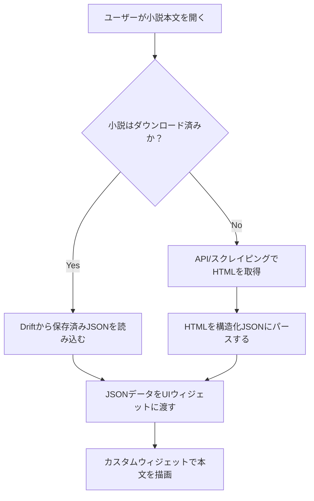

# 小説ダウンロード機能 設計書

## 1. 概要
小説をデバイスにダウンロードし、オフライン環境でも読書可能にする機能の設計書。

## 2. 目的
- ユーザーが通信環境のない場所でも小説を読めるようにする。
- アプリケーションの利用シーンを拡大し、ユーザー体験を向上させる。

## 3. 課題
ダウンロードした小説本文、特にルビを含むテキストをどのように永続化し、表示するかが主な課題となる。

- **flutter_htmlへの依存**:
  - 既存のオンライン表示で利用が検討されたが、ルビ表示に致命的な問題があり、修正の目途が立っていない。
  - このライブラリに依存し続けることは、将来的なリスクとなる。
- **データ形式の選択**:
  - HTMLをそのまま保存すると、表示の際に再び`flutter_html`の問題に直面する。
  - 独自の記法はパーサーの実装コストがかかる。
- **オンラインとオフラインの一貫性**:
  - ダウンロード済みかどうかで表示方法や体験が異なると、ユーザーの混乱を招き、コードの保守性も低下する。

## 4. 設計方針
**「オンライン・オフラインを問わず、常に同じデータ形式とウィジェットで表示する」**という方針を掲げ、以下の設計を採用する。

### 4.1. データ形式：構造化JSON
小説本文のHTMLをパースし、意味的な単位で分割したオブジェクトの配列（JSON）に変換して永続化する。

#### JSON構造の定義
- **基本形**: `List<Map<String, dynamic>>`
- **オブジェクトの種類**:
  - **通常テキスト**: `{ "type": "plain", "text": "テキスト" }`
  - **ルビ**: `{ "type": "ruby", "base": "山田太郎", "ruby": "やまだたろう" }`
  - **改行**: `{ "type": "newline" }`

#### 将来的な拡張
太字、傍点、画像などの新しい要素が必要になった場合、新しい`type`を追加することで容易に拡張可能。
例: `{ "type": "bold", "text": "強調テキスト" }`

### 4.2. アーキテクチャ
データソース（ネットワーク or ローカルDB）を抽象化し、UI層への影響をなくす。

#### データフロー

#### コンポーネントの責務
- **Repository層 (`NovelRepository`)**:
  - UI層からのデータ要求に対し、ダウンロード済みか否かを判断する。
  - ダウンロード済みならDriftから、未ダウンロードならネットワークからデータを取得し、常に同じ形式（構造化JSON）でUI層に返す。
- **Parser (`NovelParser`)**:
  - HTML文字列を受け取り、構造化JSONに変換する責務を持つ。
  - ダウンロード時とオンライン閲覧時の両方で、このパーサーが共通して使用される。
- **UI層 (カスタムウィジェット)**:
  - `NovelRepository`から受け取った構造化JSONを描画することに専念する。
  - `RichText`と`WidgetSpan`を組み合わせ、ルビなどを表現する。データソースを意識しない。

### 4.3. なろう小説HTMLのパース仕様 (想定)
- **対象範囲**: レスポンスHTML内の`
`に含まれる内容を本文とみなす。
- **段落**: `
`タグを1つの段落単位とする。
- **ルビ**: `<ruby>`タグをパースする。
  - `<ruby><rb>漢字</rb><rt>かな</rt></ruby>` という構造を想定し、`base`に「漢字」、`ruby`に「かな」を格納したJSONオブジェクトを生成する。
- **改行**: ` `タグは改行オブジェクト`{ "type": "newline" }`に変換する。

## 5. 実装タスク
1.  **HTMLパーサーの実装 (`NovelParser`)**:
    - 上記のパース仕様に基づき、HTMLを構造化JSONに変換するロジックを実装する。
2.  **カスタム描画ウィジェットの実装**:
    - 構造化JSONを受け取り、`RichText`等で画面に描画するウィジェットを作成する。
3.  **Driftのテーブル定義**:
    - ダウンロードした小説情報を格納するテーブルを作成する。本文データはJSONをシリアライズした`Text`型として保持する。
4.  **Repository層の改修 (`NovelRepository`)**:
    - データ取得ロジックに、Driftからの読み込み処理を追加する。
5.  **ダウンロード機能のUIとロジック**:
    - 小説詳細ページにダウンロードボタンを設置する。
    - ダウンロード処理（API/スクレイピング → パース → DB保存）を実装する。
