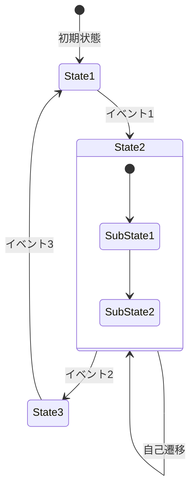
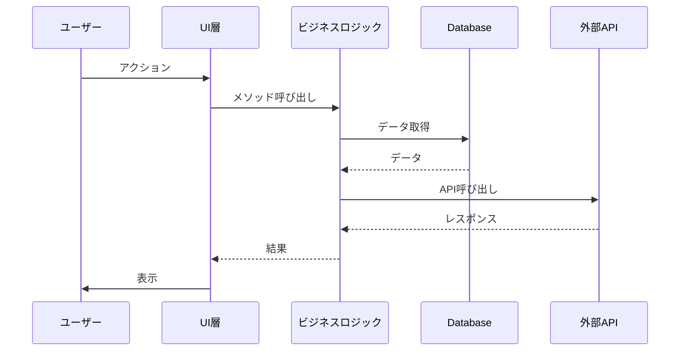
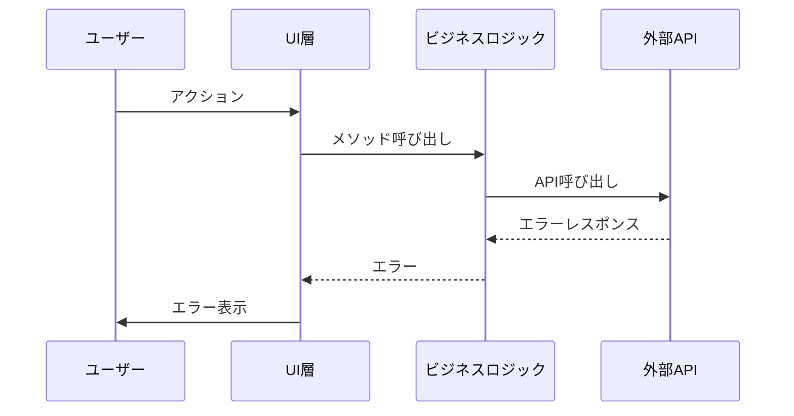
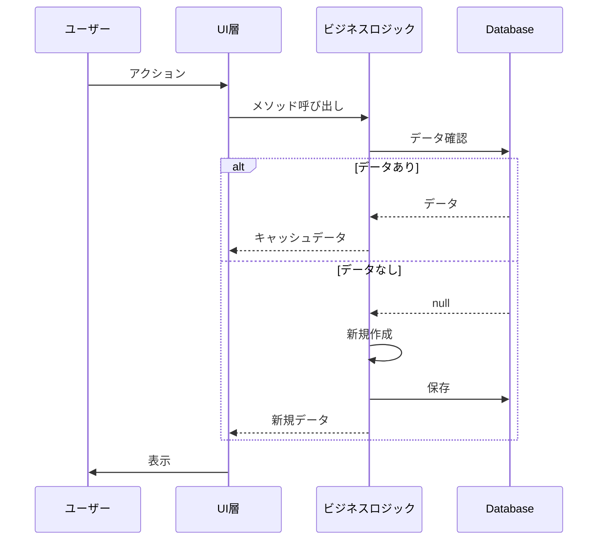
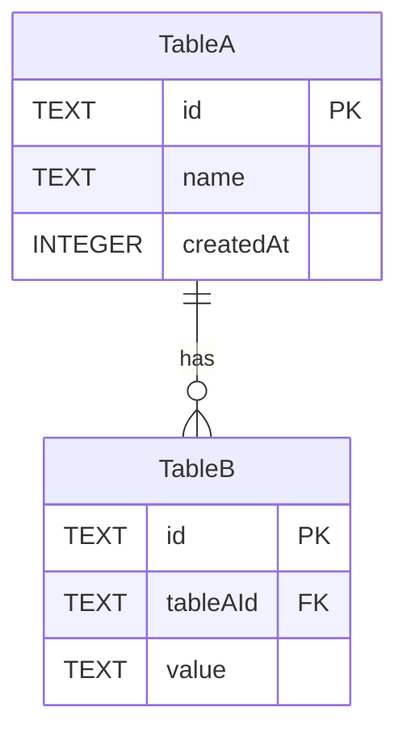
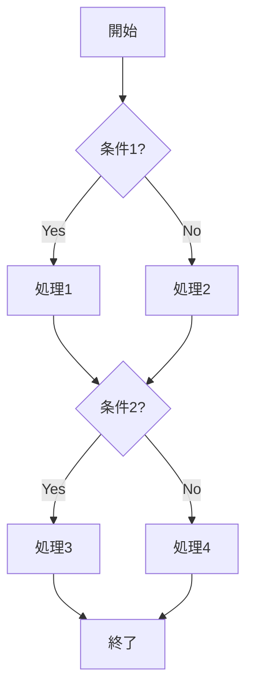
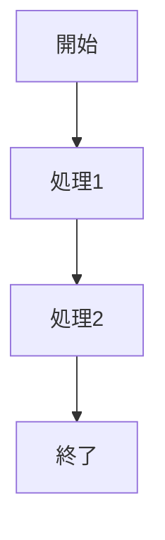
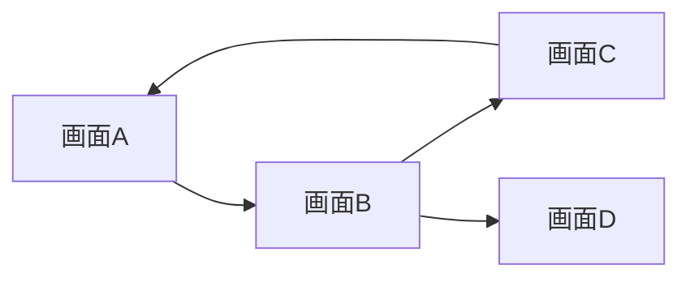

# 機能設計書テンプレート

> このテンプレートを使用して、新機能の設計書を作成してください。
> 各セクションの説明コメント（`<!-- -->`）は、実際の設計書では削除してください。

---

# [機能名] 設計書

## 1. 概要

<!--
この機能が何をするものか、1-2文で簡潔に説明してください。
-->

## 2. 目的

<!--
この機能を実装する理由・解決したい課題を箇条書きで記載してください。
-->

- **目的1**: 説明
- **目的2**: 説明
- **目的3**: 説明

## 3. 現状の課題

<!--
現在のシステムにおける問題点や制約を記載してください。
コード例があると分かりやすいです。
-->

### 3.1. 課題1

説明

```dart
// 問題のあるコード例
```

### 3.2. 課題2

説明

## 4. 設計方針

<!--
この機能の基本的な設計方針・アプローチを記載してください。
一言で表現できるキャッチフレーズがあると良いです。
-->

**「設計方針を一言で表現」**

### 4.1. 方針の詳細1

説明

### 4.2. 方針の詳細2

説明

## 5. 状態遷移図

<!--
システムの状態がどのように変化するかを図示してください。
-->

### 5.1. メイン状態遷移



### 5.2. サブ状態遷移（必要な場合）


## 6. シーケンス図

<!--
主要なユースケースについて、コンポーネント間のやり取りを図示してください。
正常系と異常系の両方を記載すると良いです。
-->

### 6.1. 正常系: [ユースケース名]



### 6.2. 異常系: [ユースケース名]



### 6.3. 条件分岐を含むケース



## 7. データ設計

<!--
データベーススキーマの変更やデータ構造を記載してください。
-->

### 7.1. ER図



### 7.2. テーブル定義

#### 変更前

| カラム | 型 | 説明 |
|--------|-----|------|
| id | TEXT | 主キー |
| name | TEXT | 名前 |

#### 変更後

| カラム | 型 | 説明 |
|--------|-----|------|
| id | TEXT | 主キー |
| name | TEXT | 名前 |
| newColumn | INTEGER | 新規追加カラム |

### 7.3. マイグレーション

```dart
if (from <= X) {
  // マイグレーション処理
  await m.addColumn(table, table.newColumn);
}
```

## 8. 処理フロー

<!--
主要な処理の流れをフローチャートで記載してください。
-->

### 8.1. メイン処理フロー



### 8.2. サブ処理フロー



## 9. API設計

<!--
新規追加・変更するクラスやメソッドのインターフェースを記載してください。
-->

### 9.1. Repository層

```dart
/// メソッドの説明
///
/// [param1] パラメータ1の説明
/// [param2] パラメータ2の説明
Future<ReturnType> methodName(
  Type param1, {
  Type? param2,
}) async {
  // 実装概要
}
```

### 9.2. Provider層

```dart
@riverpod
Future<ReturnType> providerName(
  Ref ref, {
  required Type param1,
  Type? param2,
}) async {
  // 実装概要
}
```

### 9.3. UI層での使用例

```dart
// 使用例のコード
final data = ref.watch(providerName(param1: value));
```

## 10. UI設計

<!--
UI上の変更点や新規コンポーネントについて記載してください。
ワイヤーフレームや画面遷移図があると良いです。
-->

### 10.1. 画面遷移



### 10.2. コンポーネント設計

```dart
// 新規ウィジェットの概要
class NewWidget extends HookConsumerWidget {
  const NewWidget({required this.param, super.key});
  final Type param;

  @override
  Widget build(BuildContext context, WidgetRef ref) {
    // 実装概要
  }
}
```

## 11. 実装タスク

<!--
実装に必要なタスクをチェックリスト形式で記載してください。
-->

- [ ] **1. タスクカテゴリ1**
  - [ ] サブタスク1-1
  - [ ] サブタスク1-2
  - [ ] サブタスク1-3

- [ ] **2. タスクカテゴリ2**
  - [ ] サブタスク2-1
  - [ ] サブタスク2-2

- [ ] **3. テストの実装**
  - [ ] ユニットテスト
  - [ ] ウィジェットテスト
  - [ ] 統合テスト

- [ ] **4. 既存機能との整合性確認**
  - [ ] 機能Aへの影響確認
  - [ ] 機能Bへの影響確認

## 12. 将来の拡張

<!--
現時点では実装しないが、将来的に検討する機能や改善点を記載してください。
-->

### 12.1. 拡張案1

説明

### 12.2. 拡張案2

説明

---

## 付録

### A. 用語集

<!--
設計書内で使用する専門用語や略語の定義を記載してください。
-->

| 用語 | 定義 |
|------|------|
| 用語1 | 定義1 |
| 用語2 | 定義2 |

### B. 参考資料

<!--
参考にしたドキュメントやリンクを記載してください。
-->

- [リンク1](URL)
- [リンク2](URL)

### C. 変更履歴

<!--
設計書の変更履歴を記載してください。
-->

| 日付 | バージョン | 変更内容 | 担当者 |
|------|-----------|---------|--------|
| YYYY-MM-DD | 1.0 | 初版作成 | 名前 |
